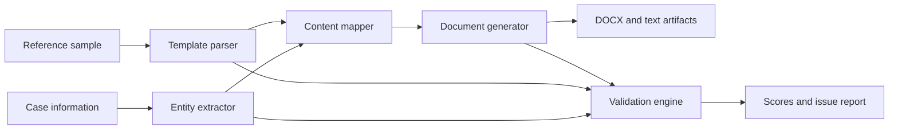

# Legal Document Generation Agent

This project is a small, reference-guided AI workflow for generating an Affidavit in Reply. It reads the supplied sample and case-information files, extracts a structured intermediate representation, maps reply points into the sample's document moves, and produces a formatted DOCX. It then evaluates the generated text with deterministic checks for entity accuracy, completeness, structure, consistency, template fidelity, and hallucination risk. The supplied demo uses no external API and is therefore reproducible on Render.

## Architecture



## Modules

- `scripts/extract_pdfs.py`: optional utility that extracts the supplied PDF source files into text fixtures.
- `src/legal_agent/template_parser.py`: detects the reference section order, paragraph count, prayer lettering, fixed phrases, and formatting expectations.
- `src/legal_agent/entity_extractor.py`: extracts the assignment's known case schema without performing independent legal research.
- `src/legal_agent/pipeline.py`: maps facts into fixed legal-document moves, renders text and DOCX, runs validation, and writes artifacts.
- `app/streamlit_app.py`: Streamlit interface for demo mode, uploads, preview, scores, and downloads.
- `data/source/`: supplied PDF reference and case files.
- `data/text/`: extracted text fixtures used by the demo.
- `outputs/`: generated affidavit, intermediate JSON, and evaluation reports.
- `docs/ARCHITECTURE.md`: detailed workflow and module explanation.

## Setup

Python 3.11 or newer is recommended.

```bash
git clone <your-repository-url>
cd Brainwonder_Assignment
python -m venv .venv
.venv\\Scripts\\activate
pip install -r requirements.txt
python -m src.legal_agent.pipeline
streamlit run app/streamlit_app.py
```

Open the local URL printed by Streamlit. The default demo uses `data/text/02_sample.txt` and `data/text/03_case.txt`. Upload text files following the same labels to test another case. No environment variable is required. `.env.example` is included for a future optional LLM provider; API keys must never be committed.

## Render deployment

1. Push this repository to GitHub.
2. In Render, choose **New > Blueprint**, connect the repository, and select `render.yaml`.
3. Deploy the `legal-document-generation-agent` web service.
4. Open the generated `onrender.com` URL. The free service may sleep when idle, so the first request can take a short time to wake it.

The working link and video demo link should be added here before submission:

- Working link: `TODO - add deployed Render URL`
- Video link: `TODO - add Loom or Google Drive URL`

## Evaluation

Each of six dimensions receives 100 when its deterministic checks pass and 50 when they fail. The overall score is the arithmetic mean. Checks include required entity presence, required sections, continuous body numbering, answering-respondent consistency, lettered prayer and exhibit conventions, and a constrained statutory hallucination check. The report includes evidence for each check and an issue list.

## Design decisions and limitations

The implementation uses a structured intermediate JSON object and deterministic templates because the assignment supplies a fixed document type and fixed facts. This makes the demo repeatable and makes validation explainable. An LLM was not made a dependency because it would add cost, nondeterministic wording, and a secret-management requirement without improving this narrow proof of concept.

This is not legal advice or a production filing system. It supports only the supplied Affidavit in Reply schema, does not perform legal research, does not implement paragraph-wise petition matching, and does not replace advocate review. PDF-to-text extraction can require cleanup for complex scans. Upload mode expects the same labeled text format as the supplied case file.

AI coding assistant used: GitHub Copilot in VS Code.
