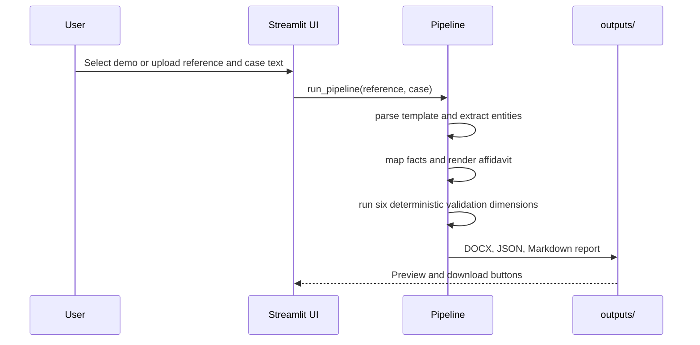

# Legal Document Generation Agent - Architecture & Workflow Documentation

## Project Overview
This application generates an Affidavit in Reply legal document by:
1. Analyzing a reference/sample affidavit to understand structure
2. Extracting entities from case information
3. Mapping case facts to the reference structure
4. Generating a new affidavit document
5. Evaluating the generated document for accuracy

## Architecture Components

```

## Module Responsibilities

### 1. Source ingestion
The supplied PDF files are converted to text once by `extract_pdfs.py`. The runtime pipeline consumes the checked-in text fixtures so Render does not need to parse PDFs on every request.

### 2. Template understanding
`template_parser.py` detects the required section order, paragraph numbering, prayer letters, fixed phrases, and formatting rules. This creates the reference-side contract used by generation and evaluation.

### 3. Entity extraction
`entity_extractor.py` reads labeled case information into a structured dictionary containing court, jurisdiction, proceeding, parties, respondent number, deponent, designation, address, dates, exhibit, advocate, and reply points.

### 4. Content mapping
`map_content()` in `pipeline.py` converts the six supplied reply points into the reference's identity, denial, preliminary position, substantive response, exhibit, and closing moves. The authority respondent rule is preserved by using the deponent's designation rather than claiming the officer is the organisation.

### 5. Document generation
`render_text()` creates the complete affidavit with headings, continuous numbered paragraphs, lettered prayer, jurat, verification, and advocate block. `write_docx()` turns the generated text into a downloadable Word document with deliberate bold and alignment conventions.

### 6. Validation and evaluation
`evaluate()` runs six deterministic dimensions. It checks supplied entities, required sections, body numbering, answering respondent consistency, template conventions, and introduction of statutory language. Scores and evidence are written as JSON and Markdown.

### 7. User interface and deployment
`app.py` runs the same pipeline in Streamlit and offers demo mode, text uploads, a preview, scores, and downloads. `render.yaml` installs `requirements.txt` and starts Streamlit using Render's assigned `$PORT`.

## Runtime Workflow



## Extension Points

An optional LLM can be inserted behind `map_content()` for less structured case files, but its output should remain constrained by the intermediate schema and the same deterministic validation layer. Additional document types should receive separate schemas and renderers rather than weakening the Affidavit in Reply contract.
┌─────────────────────────────────────────────────────────────────────────────┐
│                        LEGAL DOCUMENT GENERATION AGENT                       │
├─────────────────────────────────────────────────────────────────────────────┤
│                                                                              │
│  ┌──────────────┐    ┌──────────────┐    ┌──────────────┐    ┌──────────┐  │
│  │  Reference   │    │   Case       │    │   Entity     │    │ Template │  │
│  │  Document    │───▶│  Information │───▶│  Extraction  │───▶│  Parser  │  │
│  │  (Sample)    │    │  (Facts)     │    │  (Structured)│    │  (Schema)│  │
│  └──────────────┘    └──────────────┘    └──────────────┘    └──────────┘  │
│        │                                        │                    │       │
│        ▼                                        ▼                    ▼       │
│  ┌──────────────────────────────────────────────────────────────────────┐   │
│  │                    CONTENT MAPPING ENGINE                             │   │
│  │  • Maps case facts to template sections                              │   │
│  │  • Handles respondent-specific logic                                 │   │
│  │  • Applies fixed legal phrases                                       │   │
│  └──────────────────────────────────────────────────────────────────────┘   │
│                                    │                                        │
│                                    ▼                                        │
│  ┌──────────────────────────────────────────────────────────────────────┐   │
│  │                    DOCUMENT GENERATOR                                 │   │
│  │  • Generates DOCX with proper formatting                             │   │
│  │  • Preserves structure: headings, numbering, bold conventions        │   │
│  └──────────────────────────────────────────────────────────────────────┘   │
│                                    │                                        │
│                                    ▼                                        │
│  ┌──────────────────────────────────────────────────────────────────────┐   │
│  │                    EVALUATION ENGINE                                  │   │
│  │  • Entity Accuracy Check                                              │   │
│  │  • Completeness Check                                                 │   │
│  │  • Structure Validation                                               │   │
│  │  • Consistency Check                                                  │   │
│  │  • Template Fidelity Check                                            │   │
│  │  • Hallucination Detection                                            │   │
│  └──────────────────────────────────────────────────────────────────────┘   │
│                                    │                                        │
│                                    ▼                                        │
│  ┌──────────────────────┐  ┌──────────────────────┐  ┌────────────────┐   │
│  │  Generated Affidavit │  │  Evaluation Report   │  │  Logs &        │   │
│  │  (DOCX)              │  │  (JSON/MD)           │  │  Artifacts     │   │
│  └──────────────────────┘  └──────────────────────┘  └────────────────┘   │
│                                                                              │
└─────────────────────────────────────────────────────────────────────────────┘
```